# Inception


Project to setup a stack with multiple services using **Docker and Docker Compose**. The stack is composed of a **Wordpress** website (with 2 users), a **NodeJS** static website, a **MariaDB** database, a **Redis** cache for Wordpress, a **Adminer** database manager, a **Grafana** monitoring tool, an **FTP Server** (with 1 user) and a **Nginx** webserver with TLS (v1.2 and v1.3).

The stack is deployed on a **Docker Network** and the services are linked together. The services are deployed in **containers** and the data are stored in **volumes**. The stack is deployed on a **Linux** machine.

🗃️ [Documentation with more infos about this Project](https://github.com/Tablerase/42_Projects/tree/main/Projects/Inception)

## Services

<ul>
  <li>
    
    Nginx + TLS</a>
  </li>
  <li>
    
    MariaDB
  </li>
  <li>
    
    Wordpress + PHP
  </li>
  <li>
     Redis
  </li>
  <li>
    
    Adminer
  </li>
  <li>
    
    FTP Server - ProFTPd
  </li>
  <li>
    
    Grafana (without provisioning)
  </li>
  <li>
    
    Static Website - NodeJS + Express
  </li>
</ul>

## Architecture

```mermaid
%%{ init: { 'flowchart': { 'curve': 'basis' } } }%%
graph
  direction TB
  classDef black fill:#000,stroke:#333,stroke-width:1px;
  classDef white fill:#fff,color:#555,stroke:#333,stroke-width:1px;
  classDef white_border fill:#fff,color:#000,stroke:#333,stroke-width:1px, stroke-dasharray: 5, 5;
  classDef green fill:#0f0,color:#555,stroke:#333,stroke-width:1px;
  classDef lightblue fill:#99f,color:#fff,stroke:#333,stroke-width:1px;
  classDef lightgreen fill:#9f9,color:#555,stroke:#333,stroke-width:1px;
  classDef lightred fill:#f99,color:#555,stroke:#333,stroke-width:1px;
  classDef lightyellow fill:#ff9,color:#555,stroke:#333,stroke-width:1px;
  classDef lightorange fill:#f90,color:#555,stroke:#333,stroke-width:1px;
  classDef lightpurple fill:#f0f,color:#555,stroke:#333,stroke-width:1px;
  classDef lightcyan fill:#9ff,color:#555,stroke:#333,stroke-width:1px;
  classDef lightpink fill:#f9f,color:#555,stroke:#333,stroke-width:1px;
  classDef lightbrown fill:#963,color:#555,stroke:#333,stroke-width:1px;
  classDef lightgrey fill:#999,color:#555,stroke:#333,stroke-width:1px;
  classDef lightblack fill:#000,stroke:#333,stroke-width:1px;
  classDef lightwhite fill:#fff,color:#555,stroke:#333,stroke-width:1px;

  Project:::white_border
  subgraph Project
    direction TB
    WorldWideWeb <-->|"`*443*`"| Nginx
    WorldWideWeb((fa:fa-globe World Wide\nWeb)):::lightgreen
    WorldWideWeb <-->|"`*7500*`"| Static_Website
    WorldWideWeb <-->|"`*20-21*
    60000-60010`"| FTP_Server
    WorldWideWeb <-->|"`*7000*`"| Adminer
    WorldWideWeb <-->|"`*3000*`"| Grafana

    subgraph Computer_Host["fas:fa-computer Computer Host"]
      Docker_Network:::lightblue

      subgraph Docker_Network["fas:fa-network-wired Docker Network"]
        subgraph Wordpress_Stack
          MariaDB("fa:fa-database MariaDB\nContainer")
          Wordpress("fab:fa-wordpress Wordpress + PHP\nContainer")
          Nginx("fa:fa-server Nginx + TLS\nContainer")
          MariaDB <-->|"`*3306*`"| Wordpress <-->|"`*9000*`"| Nginx
        end
        Static_Website("fab:fa-js Static Website\nNodeJS + Express\nContainer")
        FTP_Server("fa:fa-server FTP Server\nProFTPd\nContainer")
        Adminer("fa:fa-database Adminer\nContainer")
        Adminer <-->|"`*3306*`"| MariaDB
        Redis("fa:fa-database Redis\nContainer")
        Wordpress <-->|"`*6379*`"| Redis
        Grafana("fa:fa-chart-line Grafana\nContainer")
        Grafana <-->|"`*3306*`"| MariaDB
      end

    Volume_MariaDB[("fas:fa-hdd MariaDB\nVolume\n\n/home/login/data/...")]:::lightorange
    Volume_Wordpress[("fas:fa-hdd Wordpress\nVolume\n\n/home/login/data/...")]:::lightorange
    Volume_Grafana[("fas:fa-hdd Grafana\nVolume\n\n/home/login/data/...")]:::lightorange
    MariaDB <-.-> Volume_MariaDB
    FTP_Server <-.-> Volume_Wordpress
    Wordpress <-.-> Volume_Wordpress
    Nginx <-.-> Volume_Wordpress
    Grafana <-.-> Volume_Grafana
    end
  end

  linkStyle 0,1,2,3,4 stroke:lightgreen,stroke-width:4px;
  linkStyle 5,6,7,8,9 stroke:lightblue,stroke-width:2px;
```



## Usage

### Help

```bash
# Show the help 
make help
```

### Installation

```bash
# Clone the repository
git clone git@github.com:Tablerase/42_Inception.git
```

### Configuration

```bash
# Change directory to the project
cd 42_Inception
```

```bash
# Change the LOGIN variable in the Makefile file
sed -i 's/rcutte/<your_login>/g' Makefile 
```

```bash
# Create the .env file from the .env.template file and create the secrets files from the secrets template files
make template
# Fill the .env file with your credentials
# Fill the secrets files with your credentials
```

```bash
# Add the domain name to the /etc/hosts file
make add_url
```

Edit the configuration files if needed via the `config` directory or the `setup scripts` of the services. For major changes, you can modify the [docker-compose.yml](./srcs/docker-compose.yml) file.

### Commands

#### Compose

```bash
# Compose the stack (containers, images, volumes, networks)
make up
```

```bash
# Decompose the stack (containers, images, volumes, networks)
make clean
```

```bash
# Delete the containers
make down
```

```bash
# Stop the containers
make stop
```

```bash
# Start the containers
make start
```

#### Information

```bash
# Show the logs of the stack
make logs
```

```bash
# Show the status of the stack
make infos
```

#### Maintenance

```bash
# Access to the <service> container shell (bash) / use TAB to auto-complete after shell_
make shell_<service>
```

## Access

Website to access the services:
<ul>
<li>
  
  Static Website - NodeJS + Express - <a href="http://localhost:7500">http://localhost:7500</a>
</li>
</ul>

Url to access the services:
<ul>
  <li>
    
    Wordpress - <a href="https://localhost:443">https://localhost:443</a>
  </li>
  <li>
    
    Adminer - <a href="https://localhost:7500">https://localhost:7000</a>
  </li>
  <li>
    
    FTP Server - ProFTPd - <a href="ftp://localhost:20">ftp://localhost:20</a>
  </li>
  <li>
    
    Grafana - <a href="http://localhost:3000">http://localhost:3000</a>
  </li>
  <li>
    
    Static Website - NodeJS + Express - <a href="http://localhost:7500">http://localhost:7500</a>
  </li>
</ul>